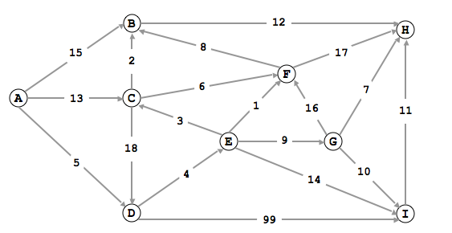

# 002

## Problem

Consider the following weighted directed graph.

Run Dijkstra's single source shortest path algorithm on the above digraph using
C as the source. Give the order in which the vertices are removed from the
priority queue. Note that A is not reachable from C, so it is never added (and
thus never removed) from the priority queue.

Also give the distance of the shortest path from C to each vertex v (except A)
and the last edge on the shortest path to v.

## Initial Thinking

- Need to research the Dijkstra algorithm implementation
- Will start with a TDD approach and then copy the image representation

## Solution

- Implemented Dijkstra algorithm and solved problem
- Implementation was based on the resource link with many modifications
    - Ported to TS and changed data structures
    - Changed to be directed graph
    - Several optimizations
- Main components: `Graph` (`Node` and `Edge`), `PriorityQueue`, `backtrace`, `times`
- Run: `npm i && npm start`
- Possible optimizations:
    - Use closures instead of classes to hide private data
    - Seems possible to not enqueue items if already included and same time

## Sources

- https://www.cs.princeton.edu/courses/archive/spr10/cos226/exercises/sp.html
- https://www.tutorialspoint.com/Dijkstra-s-algorithm-in-Javascript
- https://medium.com/@adriennetjohnson/a-walkthrough-of-dijkstras-algorithm-in-javascript-e94b74192026
